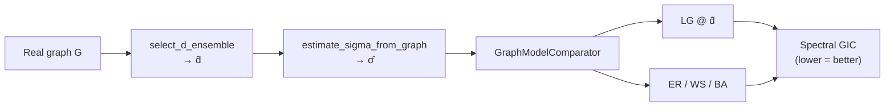
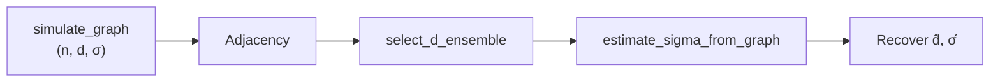

<div align="center">


# Logit Graph

**Fit, simulate, and compare logit graph models against ER / WS / BA using spectral GIC.**

[](https://pypi.org/project/logit-graph/)
[](https://pypi.org/project/logit-graph/)
[](LICENSE)
[](https://github.com/mbottoni/logit-graph/actions/workflows/ci.yml)
[](https://pypi.org/project/logit-graph/)

[Installation](#installation) ·
[Quickstart](#quickstart-60-seconds) ·
[Examples](#examples) ·
[API](docs/API.md) ·
[Changelog](CHANGELOG.md) ·
[Contributing](CONTRIBUTING.md) ·
[Issues](https://github.com/mbottoni/logit-graph/issues) ·
[Releases](https://github.com/mbottoni/logit-graph/releases)

*Scikit-learn-style API · Layer-2 offset logit · reproducible GIC (`random_state`) · on PyPI as `logit-graph`*

</div>

---

## Why Logit Graph?

| | |
|---|---|
| **Estimate** | Pick neighborhood depth `d̂` via AIC and intercept `σ̂` from real graphs |
| **Generate** | Sample graphs whose normalized-Laplacian spectrum matches the data (GIC-guided Gibbs) |
| **Compare** | Rank LG vs Erdős–Rényi, Watts–Strogatz, and Barabási–Albert on the same spectral GIC |

```bash
pip install "logit-graph>=0.1.3"
```

---

## Pipeline



<details>
<summary><strong>Alternative: simulate then recover parameters</strong></summary>



</details>

---

## Results at a glance

Reproducible comparison on SNAP Facebook ego **686** (`random_state=0`, `logit-graph>=0.1.3`):

| Model | GIC ↓ | Notes |
|-------|------:|-------|
| **LG** | **~4.07** | AIC-selected `d̂`, offset-logit `σ̂` |
| BA | ~4.12 | Preferential attachment grid search |
| WS | ~4.57 | Small-world grid search |
| ER | ~5.78 | Density-matched ER |

Full walkthrough: [`examples/pypi_fit_real_network.ipynb`](examples/pypi_fit_real_network.ipynb)

---

## Installation

```bash
pip install logit-graph
# reproducible GIC comparisons:
pip install "logit-graph>=0.1.3"
```

**Development** (uses [`uv`](https://github.com/astral-sh/uv) + `Makefile`):

```bash
git clone https://github.com/mbottoni/logit-graph.git && cd logit-graph
make install-dev
make test
```

See [CONTRIBUTING.md](CONTRIBUTING.md) for the full workflow.

| Install | Command |
|---------|---------|
| PyPI | `pip install logit-graph` |
| Editable + extras | `pip install -e ".[viz,notebook,progress]"` |
| Research env | `requirements.txt` or `environment.yml` |

---

## Quickstart (60 seconds)

Paper-consistent mode: `feature_mode="incremental"`, `β=1`.

**Simulate and recover `d̂`, `σ̂`:**

```python
from logit_graph import simulate_graph, select_d_ensemble, estimate_sigma_from_graph

adj, meta = simulate_graph(
    200, 1, sigma=-4.0, n_iter=30_000,
    feature_mode="incremental", target_density=0.10, seed=42, return_meta=True,
)
d_hat, _ = select_d_ensemble([adj], [0, 1, 2, 3], "incremental")
sigma_hat = estimate_sigma_from_graph(adj, d_hat, "incremental")
print(f"d̂={d_hat}, σ̂={sigma_hat:.3f}")
```

**Compare on a real network:**

```python
import networkx as nx
from logit_graph import GraphModelComparator, select_d_ensemble, estimate_sigma_from_graph

G = nx.convert_node_labels_to_integers(nx.read_edgelist("686.edges", nodetype=int))
adj = nx.to_numpy_array(G)
d_hat, _ = select_d_ensemble([adj], [0, 1, 2, 3], "incremental")

comparator = GraphModelComparator(
    d_list=[d_hat],
    lg_params={"max_iterations": 5000, "patience": 500, "check_interval": 50,
               "min_gic_threshold": 5, "er_p": 0.05, "edge_delta": None},
    other_models=["ER", "WS", "BA"],
    random_state=0,
).compare(G, "facebook_686")

print(comparator.summary_df.sort_values("gic_value"))
```

→ [Full API reference](docs/API.md)

---

## Examples

Self-contained notebooks under [`examples/`](examples/) — install from PyPI, fetch data when needed.

| Notebook | Description |
|----------|-------------|
| [`pypi_estimate_d_sigma.ipynb`](examples/pypi_estimate_d_sigma.ipynb) | Simulate `n=200`, recover `d̂` (AIC) and `σ̂` (offset logit) |
| [`pypi_fit_real_network.ipynb`](examples/pypi_fit_real_network.ipynb) | Real SNAP ego **686** — LG vs ER / WS / BA (GIC bar chart) |

```bash
jupyter notebook examples/pypi_estimate_d_sigma.ipynb
jupyter notebook examples/pypi_fit_real_network.ipynb
```

**Batch platform runs** (repo + local data): [`notebooks/refactors/`](notebooks/refactors/) — Facebook, Twitter, G+, Twitch.

---

## Experiments

Each experiment is a reproducible `make` target (fixed seeds, BLAS threads pinned) that writes
artifacts to a gitignored `runs/` directory. Every target has a fast `-quick` smoke variant; run
`make help` for the full list with timings. Real-network experiments expect their data under
`data/` (gitignored) — each script prints the path it needs if the files are missing.

**Naming convention.** All current experiments use the **equilibrium** Logit-Graph and carry the
**`lg-`** prefix (Makefile targets `lg-*`, scripts `scripts/**/run_lg_*.py`). Experiments for the
new **temporal** Logit-Graph use the **`tlg-`** prefix.

### Temporal Logit-Graph (`tlg-` prefix)

Experiments on the growth/temporal model `logit(P[edge forms at t]) = σ + α·D(t−1)`.

| Command | Objective |
|---------|-----------|
| `make tlg-recovery` | Recover (σ, α) from growth graphs at known ground truth, swept over d∈{0,1,2}, n∈{10…1500}, and several (σ,α) scenarios; one `recovery.png` overlaying scenarios (color = scenario) shows estimates converging onto the truth with 95% bands. |
| `make tlg-roc` | ROC (power vs significance level) for group-difference tests on **both** σ and α, in effect-size and sample-size variants, paneled by d. Default test is a single-graph two-sample Wald using the logistic-regression SEs directly (no replicates); `LG_TLGROC_METHOD=anova` switches to the replicate/ANOVA estimator. |
| `make tlg-aic-d` | AIC recovery of the degree-feature depth d: generate at a known d_true, pick d̂ = argmin AIC over candidate depths, and show recovery accuracy → 1 as n grows (plus a (d_true, d̂) confusion matrix). Unlike the equilibrium model — whose offset AIC collapses to d̂=0 — the temporal model's free α at depth d makes d identifiable. |
| `make tlg-twitch-gic` | Fit real Twitch networks with the TLG and rank families by spectral GIC. TLG: d̂ by AIC (restricted to non-degenerate depths), σ/α by logistic regression on the graph, GIC by edge-gated monitored growth (grow to ≈real edge count, then early-stop on min GIC). Baselines ER/BA/WS/KR/GRG/SBM by closed-form. Per-graph table: GIC + rank + both GIC terms (2·KL, 2·n_params) + edges/density/clustering/assortativity. `tlg-twitch-gic-all` runs all six countries. |
| `make tlg-convergence-diagnostics` | Convergence of the add+remove TLG (`allow_removal=True`): 8 chains from different initial ER densities mix to the same stationary distribution — Laplacian-spectrum / edge-count / degree-KS / adjacency-ESD-KL vs growth step all converge to a moderate-density reference. |
| `make tlg-esd-stop-eval` | Evaluate `grow_graph(until_convergence=True)`, which stops once the consecutive-snapshot adjacency-ESD KL stays below `esd_tol`: stop-step vs n, bias of the stopped graph vs a long stationary draw (KS vs noise floor), and `esd_tol` sensitivity. |

### Robust ANOVA on σ̂ (single-graph dyadic-robust Wald)

Tests whether the Logit-Graph intercept `σ` (baseline edge log-odds) differs across groups, using
**one graph per group** with a dyadic-cluster-robust SE — no re-subsampling of a single graph, so
the p-values have a genuine sampling interpretation.

| Command | Objective |
|---------|-----------|
| `make lg-anova-twitch-robust` | Compare σ̂ across the 6 Twitch language communities (omnibus + pairwise Wald). |
| `make lg-anova-connectomes-robust` | Compare σ̂ across the 18 animal connectomes (corrected "Table 2", 153 pairwise tests). |
| `make lg-anova-validation-robust` | Simulation check of the test itself: Type-I calibration + ROC/AUC vs standardized effect and graph size. |

### Paper-figure simulations (recover known parameters)

Experiments that **simulate** graphs from the equilibrium Logit-Graph at known parameters and
recover them.

| Command | Objective |
|---------|-----------|
| `make lg-sigma-convergence` | Fig 2 — σ̂ converges to the true σ as `n` grows. |
| `make lg-roc-paper` | Figs 3–4 — ANOVA-on-σ̂ ROC curves vs effect size and `n`. |
| `make lg-aic-paper-fast` | AIC `d`-selection sweep — recovers the true neighborhood radius `d` across `n`. |
| `make lg-convergence-diagnostics` | MCMC convergence diagnostics for the Layer-2 Gibbs sampler. |

### Model selection on real networks (spectral GIC)

Rank Logit-Graph against ER / WS / BA on real graphs. Two flavors per dataset:

- `make lg-gic-<dataset>` — LG vs baselines scored by spectral GIC.
- `make lg-gic-<dataset>-closedform` — closed-form (moment-matched) baselines vs fixed-grid search,
  with a fairly-scored LG.

`<dataset>` ∈ `facebook-ego`, `arxiv`, `twitch`, `twitter`, `gplus`, `connectomes` (animal),
`human-connectomes` (OASIS-3) — both flavors available. `facebook` (full MUSAE page–page graph) is
GIC-only (`make lg-gic-facebook`).

---

## Core API

| Function / class | Purpose |
|------------------|---------|
| [`simulate_graph`](docs/API.md#simulate_graph) | Generate LG at `(n, d, σ)` |
| [`select_d_ensemble`](docs/API.md#select_d_ensemble) | AIC model selection over `d` |
| [`estimate_sigma_from_graph`](docs/API.md#estimate_sigma_from_graph) | Offset-logit `σ̂` at fixed `d` |
| [`GraphModelComparator`](docs/API.md#graphmodelcomparator) | LG vs baselines (spectral GIC) |
| [`LogitGraphFitter`](docs/API.md#logitgraphfitter) | Fixed-`d` spectral fitter |

---

## Project layout

```
logit-graph/
├── src/logit_graph/     # package source
├── examples/            # PyPI-friendly tutorials
├── notebooks/           # research & batch notebooks
├── tests/               # pytest suite
├── docs/API.md          # detailed API reference
└── pyproject.toml
```

---

## Community & GitHub

| Resource | Link |
|----------|------|
| Report a bug | [Issue template](https://github.com/mbottoni/logit-graph/issues/new?template=bug_report.yml) |
| Request a feature | [Feature template](https://github.com/mbottoni/logit-graph/issues/new?template=feature_request.yml) |
| Contributing guide | [CONTRIBUTING.md](CONTRIBUTING.md) |
| Changelog | [CHANGELOG.md](CHANGELOG.md) |
| Security | [SECURITY.md](SECURITY.md) |
| CI | [GitHub Actions](https://github.com/mbottoni/logit-graph/actions) |
| Releases | [GitHub Releases](https://github.com/mbottoni/logit-graph/releases) |

**Suggested repo topics** (set under *About* on GitHub):  
`graph-generation`, `networkx`, `statistical-modeling`, `random-graphs`, `python`, `pypi`, `graph-neural-networks`, `network-science`

---

## Troubleshooting

- **Non-reproducible GIC?** Use `logit-graph>=0.1.3` and `GraphModelComparator(..., random_state=0)`.
- **Slow fits?** Reduce `max_iterations` / `patience`; compare fewer baselines; set `OPENBLAS_NUM_THREADS=1`.
- **Optional PyTorch backend** — install `[torch]` extra; statsmodels/sklearn used by default.

---

## Citation

```bibtex
@software{ottoni2025logitgraph,
  author  = {Ottoni, Maruan},
  title   = {Logit Graph: probabilistic logit-based graph modeling and selection},
  year    = {2025},
  url     = {https://github.com/mbottoni/logit-graph}
}
```

A formal publication citation will be added when available.

---

<div align="center">

**[⬆ back to top](#logit-graph)** · MIT License · [PyPI](https://pypi.org/project/logit-graph/)

</div>
